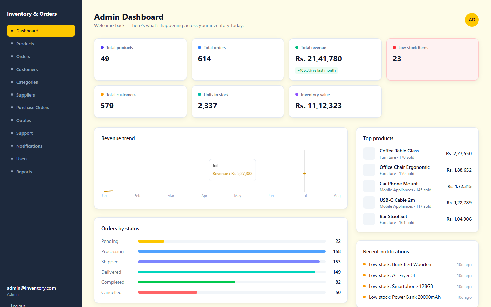
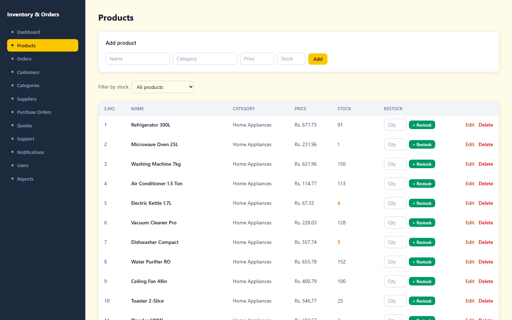
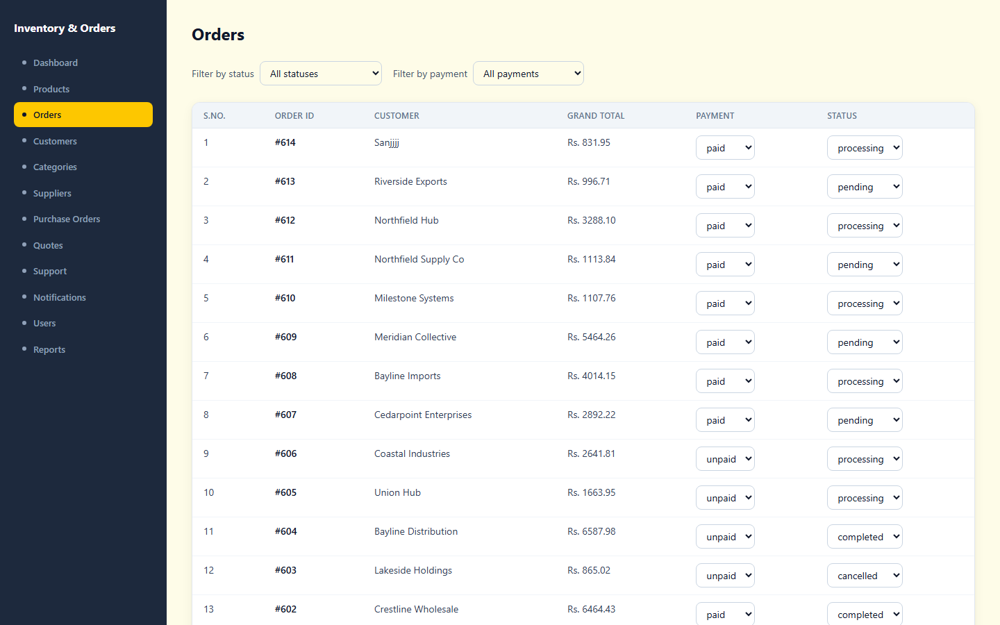
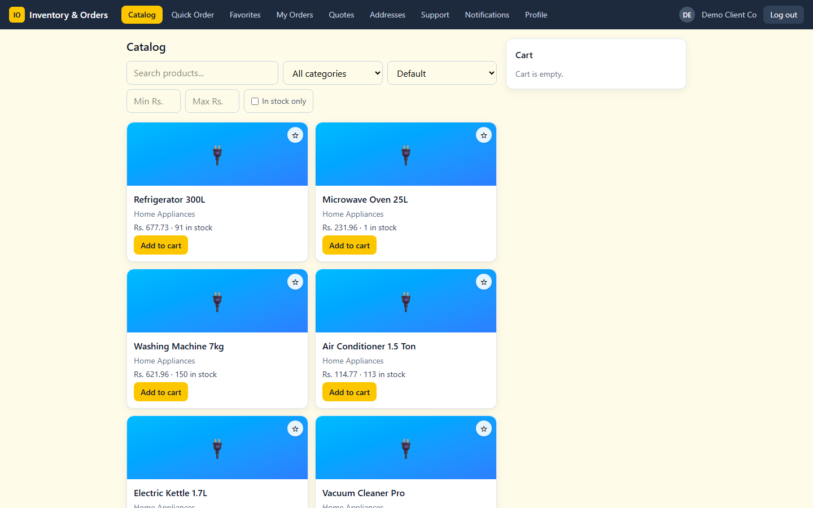
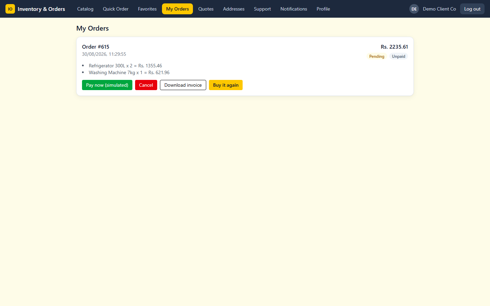

# Inventory & Order Management API

A FastAPI + SQLite B2B portal: business clients browse a catalog, request quotes,
place purchase orders, and track them; admins manage products, inventory,
suppliers, procurement, customers, and reporting. A React + Tailwind CSS
single-page app on top provides the actual client/admin UI.

## Schema

| table | key fields |
|---|---|
| `products` | `id`, `name`, `category`, `price`, `stock_qty` |
| `categories` | `id`, `name` — a suggested list; `products.category` is a denormalized string, not an FK to this table |
| `customers` | `id`, `name`, `email`, `phone`, `address`, `password_hash` (nullable — only signed-up accounts can log in) |
| `delivery_addresses` | `id`, `customer_id` -> customers, `label`, `address`, `is_default` |
| `orders` | `id`, `customer_name`, `customer_id` -> customers (nullable), `po_reference`, `created_at`, `status`, `payment_status`, `tax_amount`, `shipping_fee` |
| `order_items` | `id`, `order_id` -> orders, `product_id` -> products, `quantity`, `unit_price` |
| `quotes` / `quote_items` | a client's request for pricing before committing to an order; converts into a real `order` once priced and accepted |
| `suppliers` | `id`, `name`, `city`, `state` |
| `purchase_orders` / `purchase_order_items` | the admin side of procurement — buying stock from a supplier to replenish inventory |
| `support_messages` | `id`, `customer_name`, `customer_id`, `email`, `subject`, `message`, `status` |
| `notifications` | `id`, `audience` (`admin`/`client`), `message`, `level`, `order_id` |
| `favorites` | `id`, `customer_id` -> customers, `product_id` -> products, `list_name` (free-text, default `"Favorites"` — same denormalized-string convention as `products.category`) |
| `users` | admin/staff accounts (separate from `customers`, which is the client side) |

`unit_price` on an order line is copied from the product at order time, not read
live off the product — past orders keep showing what was actually charged even
if the product's price changes later.

`orders.customer_name` is a free-text display field; `orders.customer_id` (added
after `Order`/`Quote`/`SupportMessage` all originally scoped "my records" by a
fuzzy name match, which let one customer see another's data if their names
overlapped) is the real identity boundary and should be used for any
per-customer filtering. It's nullable because an admin can place an order on
behalf of a company that hasn't signed up for an account yet.

## Order lifecycle

`pending -> processing -> shipped -> delivered`, or `pending`/`processing ->
cancelled`. Enforced server-side (`app/security.py::can_transition`) — e.g. you
can't skip straight from `pending` to `shipped`, and a `shipped` order can no
longer be cancelled. Cancelling returns each line's quantity to stock.

## Authentication

`POST /auth/login` (admin/staff) and `POST /customers/signup` / `/customers/login`
(business clients) all return a JWT `access_token` alongside the account/customer
data. Send it back as `Authorization: Bearer <token>` on later requests.

Only **staff/admin actions** are actually gated server-side (`app/auth.py`,
`get_current_user`) — the endpoints that create/update/delete products,
categories, and suppliers; the whole purchase-orders and reports routers;
quote pricing/rejection; order status updates; and user list/delete/password-change.
`POST /users` stays open on purpose — it's the bootstrap path for creating the
first admin account (see "Running" below). Customer-facing endpoints (orders,
quotes, support, addresses, profile) are not gated by customer identity — see
"Known limitations".

## Payments

Checkout is simulated — there is no real payment gateway. `POST /orders`
computes a flat 8% tax and a flat shipping fee (waived above a free-shipping
subtotal threshold) at order time, stored on the order alongside a
`payment_status` of `unpaid`. `POST /orders/{id}/pay` flips it to `paid` (no
real money moves, no double-pay). Emails/SMS that would normally follow order
placement, status changes, and payment are only printed to the console
(`app/notifications_channel.py`) — see "Known limitations".

## Oversell prevention

`POST /orders` validates every line's stock *before* writing anything. If any
product in a multi-line order is missing or short, the whole order is rejected
with a `400` and no stock is touched. Quantities for duplicate product lines
within the same order are summed before the stock check.

## Quotes

`POST /quotes` requests pricing on a set of products (no stock check — it's
speculative). An admin prices it (`PATCH /quotes/{id}/price`), which moves it
to `quoted`. The client (or admin) then converts it (`POST
/quotes/{id}/convert`), which re-checks stock and creates a real `Order` at the
*negotiated* prices, not the live product price.

## Procurement

Separate from client-facing orders: `POST /purchase-orders` records buying
stock from a `supplier`; `POST /purchase-orders/{id}/receive` adds the ordered
quantities to `products.stock_qty` and marks it received (receiving twice is
rejected, not double-applied).

## Endpoints

- Products: `GET/POST /products`, `GET/PUT/DELETE /products/{id}`,
  `GET /products/categories`, `GET /products/low-stock`,
  `POST /products/{id}/restock` (adds to current stock atomically —
  `stock_qty = stock_qty + quantity` in one `UPDATE`, not a Python
  read-modify-write, so it can't lose an update under concurrent calls). The
  list endpoint also takes `min_price`, `max_price`, `in_stock_only`, and
  `sort=id|name|price_asc|price_desc|stock_desc`.
- Categories: `GET/POST /categories`, `DELETE /categories/{id}`
- Customers: `GET/POST /customers`, `GET/PUT/DELETE /customers/{id}`,
  `POST /customers/signup`, `POST /customers/login`
- Delivery addresses: `GET/POST /customers/{id}/addresses`,
  `DELETE /customers/{id}/addresses/{address_id}`
- Orders: `GET/POST /orders`, `GET /orders/{id}`, `GET /orders/lookup`
  (public tracking by id + customer name), `PATCH /orders/{id}/status`,
  `PATCH /orders/{id}/payment-status` (admin override, either direction —
  unlike `POST /orders/{id}/pay`, which only ever goes unpaid to paid),
  `POST /orders/{id}/cancel`, `POST /orders/{id}/pay` (simulated payment),
  `GET /orders/{id}/invoice` (PDF). The list endpoint also takes
  `payment_status=paid|unpaid`.
- Quotes: `GET/POST /quotes`, `GET /quotes/{id}`, `PATCH /quotes/{id}/price`,
  `POST /quotes/{id}/reject`, `POST /quotes/{id}/convert`
- Suppliers: `GET/POST /suppliers`, `DELETE /suppliers/{id}`
- Purchase orders: `GET/POST /purchase-orders`, `GET /purchase-orders/{id}`,
  `POST /purchase-orders/{id}/receive`
- Support: `GET/POST /support`, `POST /support/{id}/close`
- Notifications: `GET /notifications?audience=admin|client`
- Favorites (saved product lists): `GET/POST /favorites?customer_id=...`,
  `GET /favorites/lists?customer_id=...` (distinct list names for that
  customer), `DELETE /favorites/{id}`
- Users (admin/staff accounts): `GET/POST /users`, `DELETE /users/{id}`,
  `PATCH /users/{id}/password`, `POST /auth/login`
- Reports: `GET /reports/overview`, `/sales`, `/inventory`, `/low-stock`,
  `/top-products`, `/top-customers`, `/revenue-trend`, `/category-mix`

Most list endpoints accept `skip`/`limit` and return the total match count in
an `X-Total-Count` response header.

## Frontend

`frontend/` is the only client/admin-facing UI (a React + Vite + Tailwind CSS
single-page app) — the API itself has no auth-gated pages, just `/docs`. It
talks to this backend through Vite's dev-server proxy (`frontend/vite.config.js`
proxies `/api` to `http://127.0.0.1:8000`), since the API sends no CORS headers
and a direct cross-origin `fetch` from the browser would otherwise be blocked.

Routes split by role (`frontend/src/App.jsx`), matching the endpoint groups above:

- **Business client** — `/catalog` (browse + place orders, with price/stock
  filters, sort, and a favorite-star toggle), `/quick-order` (bulk add by
  product + quantity), `/favorites` (saved product lists), `/my-orders`
  (status, simulated pay, cancel, invoice download, "buy it again"), `/quotes`,
  `/support`, `/notifications`, `/addresses`, `/profile`. The cart itself
  lives in `frontend/src/context/CartContext.jsx` (in-memory, not persisted)
  so Catalog, Quick Order, and "buy it again" all add to the same cart.
- **Admin/staff** — `/admin` (dashboard stats), `/admin/products`,
  `/admin/categories`, `/admin/suppliers`, `/admin/purchase-orders`,
  `/admin/quotes` (pricing/rejection), `/admin/orders` (status transitions),
  `/admin/support`, `/admin/notifications`, `/admin/users`, `/admin/reports`
  (the remaining `/reports/*` endpoints beyond the dashboard overview).

See `frontend/README.md` for setup.

## Screenshots

**Admin**

| Dashboard | Products | Orders |
|---|---|---|
|  |  |  |

**Business client**

| Catalog | My Orders |
|---|---|
|  |  |

## Errors

- `422` — malformed input (bad types, negative price/qty). Handled by Pydantic.
- `400` — a business rule violated by well-typed input: insufficient stock, an
  invalid order-status transition, deleting a product still referenced by an
  order/quote/purchase-order, a duplicate email/code, etc.
- `404` — an id-based lookup where the id doesn't exist.

## Known limitations

This is a local demo, not a production deployment:

- **Only staff/admin actions are server-side authorized.** Customer-facing
  endpoints (placing orders, requesting quotes, managing addresses/profile)
  are not gated by the caller's identity — any customer token (or none at
  all, for endpoints that don't even check) can act on any `customer_id`.
  This was a deliberate scope decision to keep the auth layer simple and
  explainable rather than fully airtight; see "Authentication" above for
  exactly what *is* gated.
- No rate limiting or lockout on the login endpoints.
- Plain HTTP, no TLS (fine for `localhost`).
- **No real payment gateway.** `POST /orders/{id}/pay` simulates a successful
  payment — no Stripe/Razorpay integration, no card details collected.
- **No real email/SMS delivery.** `app/notifications_channel.py` prints what
  would be sent instead of calling a provider.
- `products.category` is a denormalized string, not a foreign key to
  `categories` — deleting a category doesn't touch existing products, and a
  product's category can reference a name that isn't (or is no longer) in the
  `categories` table.

## Running

```
python -m venv venv
venv\Scripts\activate
pip install -r requirements.txt
```

Optionally copy `.env.example` to `.env` to override `DATABASE_URL` or
`JWT_SECRET_KEY` — neither is required for local SQLite use.

Seed the database first (see "Seeding" below), then start both processes —
each in its own terminal:

```
uvicorn app.main:app --reload           # API on http://127.0.0.1:8000
cd frontend && npm install && npm run dev   # UI on http://localhost:5173
```

The API must already be running before you open the frontend, since every
page in it calls out through the Vite dev-server proxy to
`http://127.0.0.1:8000`. `/docs` gives you interactive Swagger docs for the
API directly. Log into the frontend as a business client via "Sign up" on the
login screen, or as admin/staff with whatever account your seed script
created (`scripts/seed_big_dataset.py` creates `admin@inventory.com` /
`admin123`; `scripts/seed.py` doesn't create any login — add one via
`POST /users`).

### Tests

```
pytest
```

## Seeding

Two options, both drop and recreate all tables first:

- `python scripts/seed.py` — a handful of hand-written demo products only, no
  customers/orders/suppliers. Fastest way to get the API into a runnable
  state; doesn't create a users login.
- `python scripts/seed_big_dataset.py` — a full synthetic dataset for
  exercising every screen in the UI: 576 customers, 57 suppliers, ~49
  products across 4 categories (Home Appliances, Furniture, Mobile
  Appliances, Home Decor), and 607 orders placed through the real API (so
  oversell prevention and stock decrement actually run) spread across
  pending/processing/shipped/delivered/completed/cancelled. Also creates the
  `admin@inventory.com` / `admin123` login. Takes a few seconds to run and
  prints a summary (revenue, low-stock count, order status breakdown) when done.
