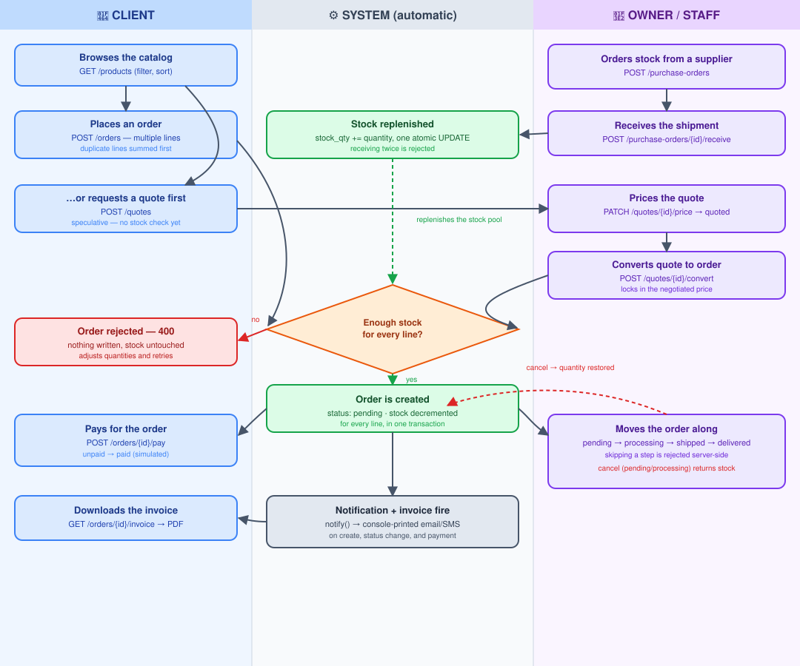

# 📦 Inventory & Order Management API

A B2B ordering: clients browse, quote, and order;
admins manage inventory, suppliers and procurement.

## ✨ Key Features

| Feature | Description | Tech Used |
|---|---|---|
| 🛡️ Oversell Prevention | Checks stock on every line before writing an order | FastAPI + SQLAlchemy |
| 💬 Quote → Order | Staff price a quote; conversion locks in that price | Pydantic v2 |
| 📈 Atomic Restocking | Purchase-order receipts update stock in one SQL UPDATE | SQLAlchemy 2.0 |
| 🔐 Staff Auth | JWT session tokens gate admin-only mutations | PyJWT |
| 🧾 PDF Invoices | Generates an order invoice on demand | fpdf2 |
| ⚛️ Admin/Client Portal | Role-based SPA, hooks only, no TypeScript | React + Tailwind |

 

## 🏗️ Architecture

 

*React SPA → FastAPI routers (JWT-gated for staff) → business-rule checks → SQLAlchemy/SQLite, with invoicing and notifications fanning out from order events.*

 
